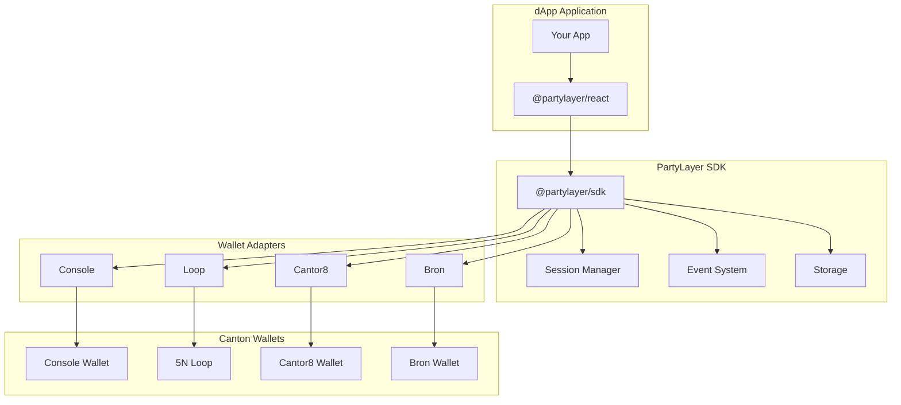

<div align="center">

# PartyLayer

**WalletConnect-like SDK for Canton Network**

Connect your dApp to multiple Canton wallets with a single integration.

[](https://www.npmjs.com/package/@partylayer/sdk)
[](https://www.typescriptlang.org/)
[](./LICENSE)
[](./CONTRIBUTING.md)

[Quick Start](#quick-start) | [Documentation](#documentation) | [Examples](#usage-examples) | [API Reference](#api-reference) | [Contributing](#contributing)

</div>

---

## What is PartyLayer?

PartyLayer is a production-grade SDK that enables decentralized applications (dApps) on the [Canton Network](https://www.canton.network/) to connect with multiple wallet providers through a unified interface. Inspired by WalletConnect, it abstracts away the complexity of integrating with different wallets.

### Why PartyLayer?

- **Single Integration**: Connect to all Canton wallets with one SDK
- **Type-Safe**: Full TypeScript support with strict mode
- **React Ready**: First-class React hooks and components
- **Secure**: Origin-bound sessions with encrypted storage
- **Extensible**: Easy to add custom wallet adapters
- **Production Ready**: Battle-tested with comprehensive error handling

### Supported Wallets

| Wallet | Type | Transport | Auto-registered | Status |
|--------|------|-----------|-----------------|--------|
| **Console Wallet** | Browser Extension | PostMessage | ✅ Yes | Ready |
| **5N Loop** | Mobile / Web | QR Code / Popup | ✅ Yes | Ready |
| **Cantor8 (C8)** | Browser Extension | Deep Link | ✅ Yes | Ready |
| **Bron** | Enterprise | OAuth2 / API | ⚙️ Requires config | Ready |

> **Note**: Bron is an enterprise wallet that requires OAuth configuration. See [Using Bron](#using-bron-enterprise-wallet) for setup instructions.

---

## Quick Start

Get started in under 3 minutes:

### 1. Install

```bash
npm install @partylayer/sdk @partylayer/react
```

### 2. Create Client

```typescript
import { createPartyLayer } from '@partylayer/sdk';

const client = createPartyLayer({
  network: 'devnet',
  app: { name: 'My dApp' },
});
```

That's it! The SDK automatically:
- Uses the default registry URL
- Registers all built-in wallet adapters (Console, Loop, Cantor8)

### 3. Connect & Sign

```typescript
// List available wallets
const wallets = await client.listWallets();

// Connect to a wallet
const session = await client.connect({ walletId: 'console' });
console.log('Connected:', session.partyId);

// Sign a message
const signed = await client.signMessage({ message: 'Hello, Canton!' });
```

### 4. React Integration

```tsx
import { PartyLayerProvider, WalletModal, useSession } from '@partylayer/react';

function App() {
  return (
    <PartyLayerProvider client={client}>
      <MyDApp />
    </PartyLayerProvider>
  );
}

function ConnectButton() {
  const session = useSession();
  const [isOpen, setIsOpen] = useState(false);

  if (session) {
    return <div>Connected: {session.partyId}</div>;
  }

  return (
    <>
      <button onClick={() => setIsOpen(true)}>Connect Wallet</button>
      <WalletModal isOpen={isOpen} onClose={() => setIsOpen(false)} />
    </>
  );
}
```

---

## Installation

### Package Manager

```bash
# npm
npm install @partylayer/sdk

# yarn
yarn add @partylayer/sdk

# pnpm
pnpm add @partylayer/sdk
```

### React Integration

```bash
npm install @partylayer/sdk @partylayer/react
```

### TypeScript

PartyLayer is written in TypeScript and includes type definitions out of the box. No additional `@types` packages needed.

**Minimum Requirements:**
- Node.js 18+
- TypeScript 5.0+ (if using TypeScript)
- React 18+ (if using React integration)

---

## Usage Examples

### Vanilla JavaScript

```typescript
import { createPartyLayer } from '@partylayer/sdk';

// Initialize
const client = createPartyLayer({
  registryUrl: 'https://registry.partylayer.xyz',
  network: 'devnet',
  app: { name: 'My dApp' },
});

// Connect
const session = await client.connect({ walletId: 'console' });

// Sign message
const { signature } = await client.signMessage({
  message: 'Authorize login',
});

// Sign transaction
const { signedTx } = await client.signTransaction({
  tx: myTransaction,
});

// Submit transaction
const { txHash } = await client.submitTransaction({
  signedTx,
});

// Listen to events
client.on('session:connected', (event) => {
  console.log('Connected:', event.session);
});

client.on('session:disconnected', () => {
  console.log('Disconnected');
});

// Disconnect
await client.disconnect();
```

### React Hooks

```tsx
import {
  PartyLayerProvider,
  usePartyLayer,
  useSession,
  useWallets,
  useConnect,
  useDisconnect,
  useSignMessage,
  WalletModal,
} from '@partylayer/react';

// Provider setup
function App() {
  const client = useMemo(() => createPartyLayer({
    registryUrl: 'https://registry.partylayer.xyz',
    network: 'devnet',
    app: { name: 'My dApp' },
  }), []);

  return (
    <PartyLayerProvider client={client}>
      <MyDApp />
    </PartyLayerProvider>
  );
}

// Using hooks
function WalletStatus() {
  const session = useSession();
  const { wallets, isLoading } = useWallets();
  const { connect, isConnecting } = useConnect();
  const { disconnect } = useDisconnect();
  const { signMessage } = useSignMessage();

  if (session) {
    return (
      <div>
        <p>Connected: {session.partyId}</p>
        <button onClick={disconnect}>Disconnect</button>
        <button onClick={() => signMessage({ message: 'Hello!' })}>
          Sign Message
        </button>
      </div>
    );
  }

  return (
    <div>
      {wallets.map((wallet) => (
        <button
          key={wallet.id}
          onClick={() => connect({ walletId: wallet.id })}
          disabled={isConnecting}
        >
          Connect {wallet.name}
        </button>
      ))}
    </div>
  );
}
```

### Next.js Integration

```tsx
// app/providers.tsx
'use client';

import { PartyLayerProvider } from '@partylayer/react';
import { createPartyLayer } from '@partylayer/sdk';
import { ConsoleAdapter } from '@partylayer/adapter-console';
import { LoopAdapter } from '@partylayer/adapter-loop';

export function Providers({ children }: { children: React.ReactNode }) {
  const [client, setClient] = useState<PartyLayerClient | null>(null);

  useEffect(() => {
    const cantonClient = createPartyLayer({
      registryUrl: process.env.NEXT_PUBLIC_REGISTRY_URL!,
      network: 'devnet',
      app: { name: 'My Next.js App' },
    });

    // Register adapters
    cantonClient.registerAdapter(new ConsoleAdapter());
    cantonClient.registerAdapter(new LoopAdapter());

    setClient(cantonClient);
    return () => cantonClient.destroy();
  }, []);

  if (!client) return <div>Loading...</div>;

  return (
    <PartyLayerProvider client={client}>
      {children}
    </PartyLayerProvider>
  );
}
```

### Using Bron (Enterprise Wallet)

Bron requires OAuth2 configuration and is not auto-registered. Add it manually:

```typescript
import { createPartyLayer, BronAdapter, getBuiltinAdapters } from '@partylayer/sdk';

const client = createPartyLayer({
  network: 'devnet',
  app: { name: 'My dApp' },
  adapters: [
    ...getBuiltinAdapters(), // Console, Loop, Cantor8
    new BronAdapter({
      auth: {
        clientId: 'your-client-id',
        redirectUri: 'https://your-app.com/auth/callback',
        authorizationUrl: 'https://auth.bron.example/authorize',
        tokenUrl: 'https://auth.bron.example/token',
      },
      api: {
        baseUrl: 'https://api.bron.example',
        getAccessToken: async () => getStoredAccessToken(),
      },
    }),
  ],
});
```

### Error Handling

```typescript
import {
  WalletNotFoundError,
  WalletNotInstalledError,
  UserRejectedError,
  SessionExpiredError,
  TimeoutError,
} from '@partylayer/sdk';

try {
  await client.connect({ walletId: 'console' });
} catch (error) {
  if (error instanceof WalletNotFoundError) {
    console.error('Wallet not found in registry');
  } else if (error instanceof WalletNotInstalledError) {
    console.error('Please install the wallet extension');
  } else if (error instanceof UserRejectedError) {
    console.error('User rejected the connection');
  } else if (error instanceof SessionExpiredError) {
    console.error('Session expired, please reconnect');
  } else if (error instanceof TimeoutError) {
    console.error('Connection timed out');
  } else {
    console.error('Unexpected error:', error);
  }
}
```

---

## Architecture



### Package Structure

| Package | Description |
|---------|-------------|
| `@partylayer/core` | Core types, errors, and transport abstractions |
| `@partylayer/sdk` | Main SDK with session management and event system |
| `@partylayer/react` | React hooks, provider, and wallet modal |
| `@partylayer/registry-client` | Registry fetching, caching, and validation |
| `@partylayer/adapter-console` | Console Wallet adapter |
| `@partylayer/adapter-loop` | 5N Loop adapter |
| `@partylayer/adapter-cantor8` | Cantor8 adapter |
| `@partylayer/adapter-bron` | Bron adapter |

---

## API Reference

### createPartyLayer

Creates a new PartyLayer client instance.

```typescript
const client = createPartyLayer(config: PartyLayerConfig);
```

#### Configuration Options

| Option | Type | Required | Default | Description |
|--------|------|----------|---------|-------------|
| `network` | `'devnet' \| 'testnet' \| 'mainnet'` | Yes | - | Target network |
| `app.name` | `string` | Yes | - | Your application name |
| `registryUrl` | `string` | No | `https://registry.partylayer.xyz/v1/wallets.json` | URL of the wallet registry |
| `app.origin` | `string` | No | `window.location.origin` | Application origin |
| `channel` | `'stable' \| 'beta'` | No | `'stable'` | Registry channel |
| `storage` | `StorageAdapter` | No | `localStorage` | Custom storage adapter |
| `adapters` | `WalletAdapter[]` | No | All built-in adapters | Custom wallet adapters |

### Client Methods

| Method | Description |
|--------|-------------|
| `listWallets(filter?)` | List available wallets from registry |
| `connect(options?)` | Connect to a wallet |
| `disconnect()` | Disconnect from current wallet |
| `getActiveSession()` | Get the current active session |
| `signMessage(params)` | Sign an arbitrary message |
| `signTransaction(params)` | Sign a transaction |
| `submitTransaction(params)` | Submit a signed transaction |
| `on(event, handler)` | Subscribe to events |
| `off(event, handler)` | Unsubscribe from events |
| `destroy()` | Clean up client resources |

### React Hooks

| Hook | Description |
|------|-------------|
| `usePartyLayer()` | Access the SDK client instance |
| `useSession()` | Get the current session |
| `useWallets()` | Get available wallets |
| `useConnect()` | Connect hook with loading state |
| `useDisconnect()` | Disconnect hook with loading state |
| `useSignMessage()` | Sign message hook |
| `useRegistryStatus()` | Get registry status |

### Events

| Event | Description |
|-------|-------------|
| `session:connected` | Wallet connected successfully |
| `session:disconnected` | Wallet disconnected |
| `session:expired` | Session has expired |
| `tx:status` | Transaction status update |
| `registry:status` | Registry status change |
| `error` | Error occurred |

---

## Security

PartyLayer implements several security measures:

### Origin Binding
Sessions are bound to the domain that created them, preventing cross-site session hijacking.

### Encrypted Storage
Session data is encrypted using Web Crypto API (AES-GCM) before storing in localStorage.

### User Consent
All wallet operations require explicit user approval:
- Connection requests display app name and permissions
- Signing operations show the payload to be signed
- Transaction submissions display transaction details

### Registry Verification
The wallet registry supports cryptographic signatures to prevent tampering.

---

## Development

### Prerequisites

- Node.js 18+
- pnpm 8+

### Setup

```bash
# Clone the repository
git clone https://github.com/cayvox/PartyLayer.git
cd wallet-sdk

# Install dependencies
pnpm install

# Build all packages
pnpm build

# Run tests
pnpm test
```

### Development Commands

```bash
# Start demo app
pnpm dev

# Run registry server
pnpm --filter registry-server dev

# Type check
pnpm typecheck

# Lint
pnpm lint

# Clean build artifacts
pnpm clean
```

### Project Structure

```
wallet-sdk/
├── packages/
│   ├── core/              # Core types and abstractions
│   ├── sdk/               # Main SDK implementation
│   ├── react/             # React integration
│   ├── registry-client/   # Registry client
│   └── adapters/          # Wallet adapters
│       ├── console/
│       ├── loop/
│       ├── cantor8/
│       └── bron/
├── apps/
│   ├── demo/              # Next.js demo application
│   └── registry-server/   # Registry server
├── examples/
│   └── test-dapp/         # Vite + React example
└── docs/                  # Documentation
```

---

## Contributing

We welcome contributions! Please see our [Contributing Guide](./CONTRIBUTING.md) for details.

### Quick Contribution Steps

1. Fork the repository
2. Create a feature branch: `git checkout -b feature/my-feature`
3. Make your changes
4. Run tests: `pnpm test`
5. Commit with conventional commits: `git commit -m "feat: add new feature"`
6. Push and create a Pull Request

### Building a Wallet Adapter

Want to add support for a new wallet? See the [Wallet Provider Guide](./docs/wallet-provider-guide.md).

---

## Roadmap

- [ ] Multi-party support (multiple parties per session)
- [ ] Transaction batching
- [ ] Mobile wallet deep links
- [ ] Offline transaction preparation
- [ ] Wallet discovery via browser extensions
- [ ] Enhanced telemetry (opt-in)

---

## FAQ

<details>
<summary><strong>Which wallets are supported?</strong></summary>

Currently supported: Console Wallet, 5N Loop, Cantor8, and Bron. All adapters are included in the SDK.
</details>

<details>
<summary><strong>Do I need to install wallet adapters separately?</strong></summary>

No! All wallet adapters are bundled with `@partylayer/sdk`. Just install the SDK and you're ready to go.
</details>

<details>
<summary><strong>How does session persistence work?</strong></summary>

Sessions are encrypted and stored in localStorage. On page reload, the SDK attempts to restore existing sessions. Wallets that support session restoration (like Console) will automatically reconnect.
</details>

<details>
<summary><strong>Is the SDK compatible with Next.js?</strong></summary>

Yes! PartyLayer works with Next.js. Use the `'use client'` directive and initialize the client in a `useEffect` hook to ensure it runs only on the client side.
</details>

<details>
<summary><strong>How do I handle connection errors?</strong></summary>

PartyLayer exports typed error classes. Use `try-catch` with `instanceof` checks to handle specific error types like `WalletNotInstalledError` or `UserRejectedError`.
</details>

---

## Documentation

- [Quick Start Guide](./docs/quick-start.md)
- [API Reference](./docs/api.md)
- [Architecture](./docs/architecture.md)
- [Error Handling](./docs/errors.md)
- [Wallet Provider Guide](./docs/wallet-provider-guide.md)
- [Security Checklist](./docs/security-checklist.md) - For wallet providers
- [Production Security Guide](./docs/security-production.md) - For dApp developers

---

## Support

- [GitHub Issues](https://github.com/cayvox/PartyLayer/issues) - Bug reports and feature requests
- [Discussions](https://github.com/cayvox/PartyLayer/discussions) - Questions and community

---

## License

MIT License - see [LICENSE](./LICENSE) for details.

---

## Acknowledgments

- [Canton Network](https://www.canton.network/) - The privacy-enabled blockchain network
- [Digital Asset](https://www.digitalasset.com/) - Daml and Canton development
- [WalletConnect](https://walletconnect.com/) - Inspiration for the SDK design

---

<div align="center">

**Built with ❤️ for the Canton Network ecosystem**

[Website](https://partylayer.xyz) | [Documentation](./docs/) | [GitHub](https://github.com/cayvox/PartyLayer)

</div>
