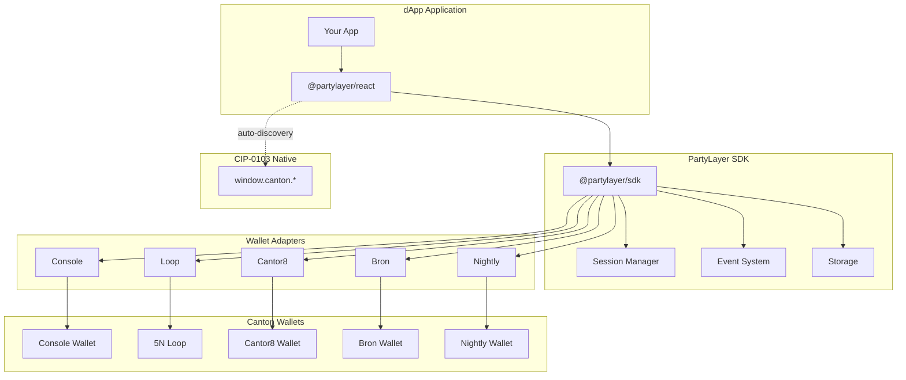

<div align="center">

# PartyLayer

**WalletConnect-like SDK for Canton Network**

Connect your dApp to multiple Canton wallets with a single integration.

[](https://www.npmjs.com/package/@partylayer/sdk)
[](https://www.typescriptlang.org/)
[](./LICENSE)
[](./CONTRIBUTING.md)

[Quick Start](#quick-start) | [CIP-0103](#cip-0103-canton-dapp-standard-compliance) | [Documentation](#documentation) | [Examples](#usage-examples) | [API Reference](#api-reference) | [Contributing](#contributing)

</div>

---

## What is PartyLayer?

PartyLayer is a production-grade SDK that enables decentralized applications (dApps) on the [Canton Network](https://www.canton.network/) to connect with multiple wallet providers through a unified interface. Inspired by WalletConnect, it abstracts away the complexity of integrating with different wallets.

### Why PartyLayer?

- **CIP-0103 Compliant**: Implements the Canton dApp Standard for wallet-dApp communication
- **Single Integration**: Connect to all Canton wallets with one SDK
- **Type-Safe**: Full TypeScript support with strict mode
- **React Ready**: First-class React hooks and components
- **Secure**: Origin-bound sessions with encrypted storage
- **Extensible**: Easy to add custom wallet adapters
- **Production Ready**: Battle-tested with comprehensive error handling

### Supported Wallets

| Wallet | Type | Transport | Auto-registered | Status |
|--------|------|-----------|-----------------|--------|
| **Console Wallet** | Browser Extension | PostMessage | ✅ Yes | Ready |
| **5N Loop** | Mobile / Web | QR Code / Popup | ✅ Yes | Ready |
| **Cantor8 (C8)** | Browser Extension | Deep Link | ✅ Yes | Ready |
| **Nightly** | Multichain Wallet | Injected | ✅ Yes | Ready |
| **Bron** | Enterprise | OAuth2 / API | ⚙️ Requires config | Ready |

> **Note**: Bron is an enterprise wallet that requires OAuth configuration. See [Using Bron](#using-bron-enterprise-wallet) for setup instructions.
>
> **Native CIP-0103 wallets** are also auto-discovered at runtime via `window.canton.*` — no configuration needed.

---

## Quick Start

Get started in under 3 minutes:

### 1. Install

```bash
npm install @partylayer/sdk @partylayer/react
```

### 2. Add to Your App (Zero Config)

```tsx
import { PartyLayerKit, ConnectButton } from '@partylayer/react';

function App() {
  return (
    <PartyLayerKit network="devnet" appName="My dApp">
      <ConnectButton />
      <YourApp />
    </PartyLayerKit>
  );
}
```

That's it! `PartyLayerKit` automatically:
- Creates and manages the SDK client
- Registers all built-in wallet adapters (Console, Loop, Cantor8, Nightly)
- Discovers native CIP-0103 wallets (`window.canton.*`)
- Provides light/dark/auto theme support

### 3. Connect & Sign (Vanilla JS)

```typescript
import { createPartyLayer } from '@partylayer/sdk';

const client = createPartyLayer({
  network: 'devnet',
  app: { name: 'My dApp' },
});

// List available wallets
const wallets = await client.listWallets();

// Connect to a wallet
const session = await client.connect({ walletId: 'console' });
console.log('Connected:', session.partyId);

// Sign a message
const signed = await client.signMessage({ message: 'Hello, Canton!' });
```

---

## Installation

### Package Manager

```bash
# npm
npm install @partylayer/sdk

# yarn
yarn add @partylayer/sdk

# pnpm
pnpm add @partylayer/sdk
```

### React Integration

```bash
npm install @partylayer/sdk @partylayer/react
```

### TypeScript

PartyLayer is written in TypeScript and includes type definitions out of the box. No additional `@types` packages needed.

**Minimum Requirements:**
- Node.js 18+
- TypeScript 5.0+ (if using TypeScript)
- React 18+ (if using React integration)

---

## Usage Examples

### Vanilla JavaScript

```typescript
import { createPartyLayer } from '@partylayer/sdk';

// Initialize
const client = createPartyLayer({
  registryUrl: 'https://registry.partylayer.xyz',
  network: 'devnet',
  app: { name: 'My dApp' },
});

// Connect
const session = await client.connect({ walletId: 'console' });

// Sign message
const { signature } = await client.signMessage({
  message: 'Authorize login',
});

// Sign transaction
const { signedTx } = await client.signTransaction({
  tx: myTransaction,
});

// Submit transaction
const { txHash } = await client.submitTransaction({
  signedTx,
});

// Listen to events
client.on('session:connected', (event) => {
  console.log('Connected:', event.session);
});

client.on('session:disconnected', () => {
  console.log('Disconnected');
});

// Disconnect
await client.disconnect();
```

### React — PartyLayerKit (Recommended)

The simplest way to add wallet connectivity to a React app:

```tsx
import { PartyLayerKit, ConnectButton } from '@partylayer/react';

function App() {
  return (
    <PartyLayerKit
      network="devnet"
      appName="My dApp"
      theme="auto"  // 'light' | 'dark' | 'auto' | custom theme object
    >
      <ConnectButton />
      <MyDApp />
    </PartyLayerKit>
  );
}
```

`ConnectButton` renders a RainbowKit-style button that handles the entire connect flow: wallet selection modal, connection, success/error states, and a connected dropdown with disconnect.

### React Hooks

For custom UIs, use the hooks directly:

```tsx
import {
  PartyLayerKit,
  useSession,
  useWallets,
  useConnect,
  useDisconnect,
  useSignMessage,
  WalletModal,
} from '@partylayer/react';

function App() {
  return (
    <PartyLayerKit network="devnet" appName="My dApp">
      <MyDApp />
    </PartyLayerKit>
  );
}

function WalletStatus() {
  const session = useSession();
  const { wallets, isLoading } = useWallets();
  const { connect, isConnecting } = useConnect();
  const { disconnect } = useDisconnect();
  const { signMessage } = useSignMessage();

  if (session) {
    return (
      <div>
        <p>Connected: {session.partyId}</p>
        <button onClick={disconnect}>Disconnect</button>
        <button onClick={() => signMessage({ message: 'Hello!' })}>
          Sign Message
        </button>
      </div>
    );
  }

  return (
    <div>
      {wallets.map((wallet) => (
        <button
          key={String(wallet.walletId)}
          onClick={() => connect({ walletId: wallet.walletId })}
          disabled={isConnecting}
        >
          Connect {wallet.name}
        </button>
      ))}
    </div>
  );
}
```

### Next.js Integration

```tsx
// app/providers.tsx
'use client';

import { PartyLayerKit, ConnectButton } from '@partylayer/react';

export function Providers({ children }: { children: React.ReactNode }) {
  return (
    <PartyLayerKit
      network="devnet"
      appName="My Next.js App"
      registryUrl={process.env.NEXT_PUBLIC_REGISTRY_URL}
      theme="auto"
    >
      {children}
    </PartyLayerKit>
  );
}
```

> **Monorepo note**: If using workspace packages, add `@partylayer/*` packages to `transpilePackages` and webpack `resolve.alias` in `next.config.js`. See the demo app for a complete example.

### Using Bron (Enterprise Wallet)

Bron requires OAuth2 configuration and is not auto-registered. Add it manually:

```typescript
import { createPartyLayer, BronAdapter, getBuiltinAdapters } from '@partylayer/sdk';

const client = createPartyLayer({
  network: 'devnet',
  app: { name: 'My dApp' },
  adapters: [
    ...getBuiltinAdapters(), // Console, Loop, Cantor8, Nightly
    new BronAdapter({
      auth: {
        clientId: 'your-client-id',
        redirectUri: 'https://your-app.com/auth/callback',
        authorizationUrl: 'https://auth.bron.example/authorize',
        tokenUrl: 'https://auth.bron.example/token',
      },
      api: {
        baseUrl: 'https://api.bron.example',
        getAccessToken: async () => getStoredAccessToken(),
      },
    }),
  ],
});
```

### Error Handling

```typescript
import {
  WalletNotFoundError,
  WalletNotInstalledError,
  UserRejectedError,
  SessionExpiredError,
  TimeoutError,
} from '@partylayer/sdk';

try {
  await client.connect({ walletId: 'console' });
} catch (error) {
  if (error instanceof WalletNotFoundError) {
    console.error('Wallet not found in registry');
  } else if (error instanceof WalletNotInstalledError) {
    console.error('Please install the wallet extension');
  } else if (error instanceof UserRejectedError) {
    console.error('User rejected the connection');
  } else if (error instanceof SessionExpiredError) {
    console.error('Session expired, please reconnect');
  } else if (error instanceof TimeoutError) {
    console.error('Connection timed out');
  } else {
    console.error('Unexpected error:', error);
  }
}
```

---

## Architecture



### Package Structure

| Package | Description |
|---------|-------------|
| `@partylayer/core` | Core types, errors, transport abstractions, and CIP-0103 type definitions |
| `@partylayer/sdk` | Main SDK with session management and event system |
| `@partylayer/provider` | CIP-0103 native Provider, bridge, wallet discovery, and error model |
| `@partylayer/react` | React hooks, provider, and wallet modal |
| `@partylayer/registry-client` | Registry fetching, caching, and validation |
| `@partylayer/conformance-runner` | CLI for adapter and CIP-0103 conformance testing |
| `@partylayer/adapter-console` | Console Wallet adapter |
| `@partylayer/adapter-loop` | 5N Loop adapter |
| `@partylayer/adapter-cantor8` | Cantor8 adapter |
| `@partylayer/adapter-bron` | Bron adapter |
| `@partylayer/adapter-nightly` | Nightly multichain wallet adapter |

---

## API Reference

### createPartyLayer

Creates a new PartyLayer client instance.

```typescript
const client = createPartyLayer(config: PartyLayerConfig);
```

#### Configuration Options

| Option | Type | Required | Default | Description |
|--------|------|----------|---------|-------------|
| `network` | `'devnet' \| 'testnet' \| 'mainnet'` | Yes | - | Target network |
| `app.name` | `string` | Yes | - | Your application name |
| `registryUrl` | `string` | No | `https://registry.partylayer.xyz/v1/wallets.json` | URL of the wallet registry |
| `app.origin` | `string` | No | `window.location.origin` | Application origin |
| `channel` | `'stable' \| 'beta'` | No | `'stable'` | Registry channel |
| `storage` | `StorageAdapter` | No | `localStorage` | Custom storage adapter |
| `adapters` | `WalletAdapter[]` | No | All built-in adapters | Custom wallet adapters |

### Client Methods

| Method | Description |
|--------|-------------|
| `listWallets(filter?)` | List available wallets (registry + registered adapters) |
| `connect(options?)` | Connect to a wallet |
| `disconnect()` | Disconnect from current wallet |
| `getActiveSession()` | Get the current active session |
| `signMessage(params)` | Sign an arbitrary message |
| `signTransaction(params)` | Sign a transaction |
| `submitTransaction(params)` | Submit a signed transaction |
| `registerAdapter(adapter)` | Register a custom wallet adapter at runtime |
| `asProvider()` | Get a CIP-0103 compliant Provider bridge |
| `on(event, handler)` | Subscribe to events |
| `off(event, handler)` | Unsubscribe from events |
| `destroy()` | Clean up client resources |

### React Hooks

| Hook | Description |
|------|-------------|
| `usePartyLayer()` | Access the SDK client instance |
| `useSession()` | Get the current session |
| `useWallets()` | Get available wallets (registry + native CIP-0103) |
| `useConnect()` | Connect hook with loading state |
| `useDisconnect()` | Disconnect hook with loading state |
| `useSignMessage()` | Sign message hook |
| `useSignTransaction()` | Sign transaction hook |
| `useSubmitTransaction()` | Submit transaction hook |
| `useRegistryStatus()` | Get registry status |
| `useWalletIcons()` | Access wallet icon overrides from PartyLayerKit |
| `useTheme()` | Access current theme (light/dark/auto) |

### Events

| Event | Description |
|-------|-------------|
| `session:connected` | Wallet connected successfully |
| `session:disconnected` | Wallet disconnected |
| `session:expired` | Session has expired |
| `tx:status` | Transaction status update |
| `registry:status` | Registry status change |
| `error` | Error occurred |

---

## Security

PartyLayer implements several security measures:

### Origin Binding
Sessions are bound to the domain that created them, preventing cross-site session hijacking.

### Encrypted Storage
Session data is encrypted using Web Crypto API (AES-GCM) before storing in localStorage.

### User Consent
All wallet operations require explicit user approval:
- Connection requests display app name and permissions
- Signing operations show the payload to be signed
- Transaction submissions display transaction details

### Registry Verification
The wallet registry supports cryptographic signatures to prevent tampering.

---

## CIP-0103 (Canton dApp Standard) Compliance

PartyLayer implements [CIP-0103](https://www.canton.network/cip-0103), the Canton dApp Standard for wallet-dApp communication. The `@partylayer/provider` package provides a spec-compliant Provider interface.

### Provider Model

PartyLayer offers two paths to CIP-0103 compliance:

**Native Provider** (`PartyLayerProvider`) — wraps any CIP-0103-compliant wallet provider (e.g. `window.canton.*`). This is the recommended path for new integrations.

```typescript
import { PartyLayerProvider, discoverInjectedProviders } from '@partylayer/provider';

// Discover injected CIP-0103 wallets
const wallets = discoverInjectedProviders();

// Create a Provider backed by a native wallet
const provider = new PartyLayerProvider({ wallet: wallets[0].provider });
```

**Legacy Bridge** (`createProviderBridge`) — wraps an existing `PartyLayerClient` instance as a CIP-0103 Provider. Use this for backward compatibility with the adapter-based SDK.

```typescript
import { createPartyLayer } from '@partylayer/sdk';

const client = createPartyLayer({ network: 'devnet', app: { name: 'My dApp' } });
const provider = client.asProvider();
```

### CIP-0103 Methods

All 10 mandatory methods are implemented on both paths:

| Method | Description |
|--------|-------------|
| `connect` | Establish wallet connection |
| `disconnect` | Close wallet connection |
| `isConnected` | Check connection status |
| `status` | Get full provider status (connection, identity, network, session) |
| `getActiveNetwork` | Get active network as a CAIP-2 identifier |
| `listAccounts` | List available accounts |
| `getPrimaryAccount` | Get the primary account |
| `signMessage` | Sign an arbitrary message |
| `prepareExecute` | Prepare and submit a transaction |
| `ledgerApi` | Proxy Ledger API requests (native path only) |

### Usage Example

```typescript
import { PartyLayerProvider } from '@partylayer/provider';

const provider = new PartyLayerProvider({ wallet: nativeWallet });

// Connect
const result = await provider.request({ method: 'connect' });
console.log(result.isConnected); // true

// Listen for status changes
provider.on('statusChanged', (status) => {
  console.log('Connection:', status.connection.isConnected);
  console.log('Network:', status.network?.networkId);
});

// Listen for transaction lifecycle
provider.on('txChanged', (event) => {
  switch (event.status) {
    case 'pending':  console.log('Tx pending:', event.commandId); break;
    case 'executed': console.log('Tx executed:', event.payload.updateId); break;
    case 'failed':   console.log('Tx failed:', event.commandId); break;
  }
});

// Sign a message
const signature = await provider.request({
  method: 'signMessage',
  params: { message: 'Hello, Canton!' },
});

// Prepare and execute a transaction
await provider.request({
  method: 'prepareExecute',
  params: { /* transaction payload */ },
});
```

### Sync and Async Wallet Support

The native `PartyLayerProvider` supports both synchronous and asynchronous wallet flows:

- **Sync wallets** return results immediately from `connect()` and `prepareExecute()`.
- **Async wallets** (e.g. mobile wallets with QR codes) return a `userUrl` from `connect()`. The Provider handles the async flow automatically: it opens the URL, waits for the `connected` event, and resolves the Promise when the wallet confirms.

> **Note**: The legacy bridge (`client.asProvider()`) only supports synchronous wallets. For async wallet flows, use the native `PartyLayerProvider` directly.

### Error Model

The CIP-0103 Provider uses `ProviderRpcError` with standard numeric error codes from EIP-1193 and EIP-1474:

**EIP-1193 (Provider) Codes:**

| Code | Name | Description |
|------|------|-------------|
| 4001 | User Rejected | User rejected the request |
| 4100 | Unauthorized | Not authorized for this operation |
| 4200 | Unsupported Method | Method not supported by this provider |
| 4900 | Disconnected | Provider is disconnected |
| 4901 | Chain Disconnected | Provider is disconnected from the requested chain |

**EIP-1474 (JSON-RPC) Codes:**

| Code | Name | Description |
|------|------|-------------|
| -32700 | Parse Error | Invalid JSON |
| -32600 | Invalid Request | Request object is invalid |
| -32601 | Method Not Found | Method does not exist |
| -32602 | Invalid Params | Invalid method parameters |
| -32603 | Internal Error | Internal provider error |
| -32000 | Invalid Input | Missing or invalid parameter |
| -32001 | Resource Not Found | Requested resource not found |
| -32002 | Resource Unavailable | Requested resource is not available |
| -32003 | Transaction Rejected | Transaction was rejected |
| -32004 | Method Not Supported | Method is not implemented |
| -32005 | Limit Exceeded | Rate or resource limit exceeded |

```typescript
import { ProviderRpcError, RPC_ERRORS } from '@partylayer/provider';

try {
  await provider.request({ method: 'signMessage', params: { message: 'test' } });
} catch (err) {
  if (err instanceof ProviderRpcError) {
    switch (err.code) {
      case RPC_ERRORS.USER_REJECTED:
        console.log('User declined');
        break;
      case RPC_ERRORS.DISCONNECTED:
        console.log('Not connected');
        break;
      default:
        console.log(`Error ${err.code}: ${err.message}`);
    }
  }
}
```

### Conformance Testing

The `@partylayer/conformance-runner` package validates CIP-0103 compliance for any Provider implementation:

```typescript
import { runCIP0103ConformanceTests, formatCIP0103Report } from '@partylayer/conformance-runner';

const report = await runCIP0103ConformanceTests(provider);
console.log(formatCIP0103Report(report));
// ═══ CIP-0103 Conformance Report ═══
// Total: 18  Passed: 18  Failed: 0
```

---

## Development

### Prerequisites

- Node.js 18+
- pnpm 8+

### Setup

```bash
# Clone the repository
git clone https://github.com/anilkaracay/partylayer.git
cd partylayer

# Install dependencies
pnpm install

# Build all packages
pnpm build

# Run tests
pnpm test
```

### Development Commands

```bash
# Start demo app
pnpm dev

# Run registry server
pnpm --filter registry-server dev

# Type check
pnpm typecheck

# Lint
pnpm lint

# Clean build artifacts
pnpm clean
```

### Project Structure

```
wallet-sdk/
├── packages/
│   ├── core/              # Core types, errors, and CIP-0103 type definitions
│   ├── sdk/               # Main SDK implementation
│   ├── provider/          # CIP-0103 native Provider and bridge
│   ├── react/             # React integration
│   ├── registry-client/   # Registry client
│   ├── conformance-runner/ # Adapter & CIP-0103 conformance testing CLI
│   └── adapters/          # Wallet adapters
│       ├── console/
│       ├── loop/
│       ├── cantor8/
│       ├── bron/
│       └── nightly/
├── apps/
│   ├── demo/              # Next.js demo application
│   └── registry-server/   # Registry server
├── examples/
│   └── test-dapp/         # Vite + React example
└── docs/                  # Documentation
```

---

## Contributing

We welcome contributions! Please see our [Contributing Guide](./CONTRIBUTING.md) for details.

### Quick Contribution Steps

1. Fork the repository
2. Create a feature branch: `git checkout -b feature/my-feature`
3. Make your changes
4. Run tests: `pnpm test`
5. Commit with conventional commits: `git commit -m "feat: add new feature"`
6. Push and create a Pull Request

### Building a Wallet Adapter

Want to add support for a new wallet? See the [Wallet Provider Guide](./docs/wallet-provider-guide.md).

---

## Roadmap

- [ ] Multi-party support (multiple parties per session)
- [ ] Transaction batching
- [ ] Offline transaction preparation
- [x] CIP-0103 (Canton dApp Standard) compliance
- [x] Native CIP-0103 wallet discovery (`window.canton.*`)
- [x] Enhanced telemetry (opt-in, privacy-safe)
- [x] PartyLayerKit zero-config React wrapper
- [x] ConnectButton with wallet modal
- [x] Light/dark/auto theme support
- [x] Nightly multichain wallet support

---

## FAQ

<details>
<summary><strong>Which wallets are supported?</strong></summary>

5 wallets built-in: Console Wallet, 5N Loop, Cantor8, Nightly, and Bron. Console, Loop, Cantor8, and Nightly are auto-registered. Bron requires OAuth configuration. Additionally, any CIP-0103 compliant wallet injected at `window.canton.*` is auto-discovered at runtime.
</details>

<details>
<summary><strong>What is PartyLayerKit vs PartyLayerProvider?</strong></summary>

`PartyLayerKit` is a zero-config wrapper that creates the SDK client, registers adapters, discovers native wallets, and sets up theming — all automatically. `PartyLayerProvider` is the lower-level context provider for advanced use cases where you need full control over client configuration. For most apps, use `PartyLayerKit`.
</details>

<details>
<summary><strong>Do I need to install wallet adapters separately?</strong></summary>

No! All wallet adapters (except Bron) are bundled with `@partylayer/sdk`. Just install the SDK and you're ready to go.
</details>

<details>
<summary><strong>How does session persistence work?</strong></summary>

Sessions are encrypted and stored in localStorage. On page reload, the SDK attempts to restore existing sessions. Wallets that support session restoration (like Console and Nightly) will automatically reconnect.
</details>

<details>
<summary><strong>Is the SDK compatible with Next.js?</strong></summary>

Yes! Use `PartyLayerKit` with the `'use client'` directive. For monorepo setups, add `@partylayer/*` packages to `transpilePackages` in `next.config.js`.
</details>

<details>
<summary><strong>How do I handle connection errors?</strong></summary>

PartyLayer exports typed error classes. Use `try-catch` with `instanceof` checks to handle specific error types like `WalletNotInstalledError` or `UserRejectedError`. The `WalletModal` component handles these automatically with dedicated error views.
</details>

---

## Documentation

- [Quick Start Guide](./docs/quick-start.md)
- [API Reference](./docs/api.md)
- [Architecture](./docs/architecture.md)
- [CIP-0103 Compliance](#cip-0103-canton-dapp-standard-compliance) - Provider model, methods, error codes
- [CIP-0103 Alignment (detailed)](./docs/CIP-0103-ALIGNMENT.md) - For Foundation reviewers and wallet providers
- [Error Handling](./docs/errors.md)
- [Wallet Provider Guide](./docs/wallet-provider-guide.md)
- [Security Checklist](./docs/security-checklist.md) - For wallet providers
- [Production Security Guide](./docs/security-production.md) - For dApp developers

---

## Support

- [GitHub Issues](https://github.com/anilkaracay/partylayer/issues) - Bug reports and feature requests
- [Discussions](https://github.com/anilkaracay/partylayer/discussions) - Questions and community

---

## License

MIT License - see [LICENSE](./LICENSE) for details.

---

## Acknowledgments

- [Canton Network](https://www.canton.network/) - The privacy-enabled blockchain network
- [Digital Asset](https://www.digitalasset.com/) - Daml and Canton development
- [WalletConnect](https://walletconnect.com/) - Inspiration for the SDK design

---

<div align="center">

**Built with ❤️ for the Canton Network ecosystem**

[Website](https://partylayer.xyz) | [Documentation](./docs/) | [GitHub](https://github.com/anilkaracay/partylayer)

</div>
